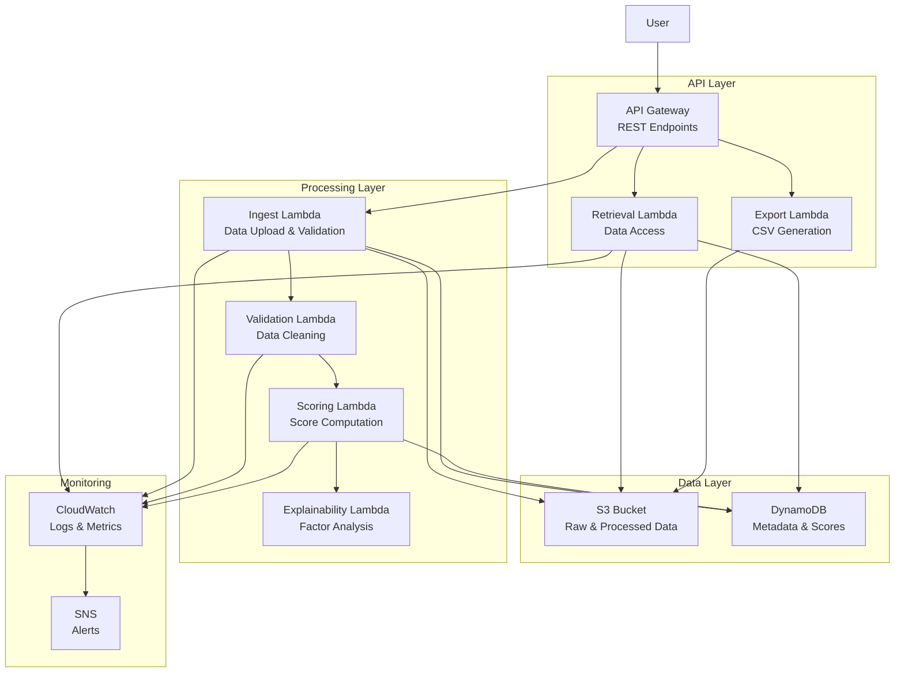

# Design Document: Anveshaka Readiness

## Overview

Anveshaka Readiness is a serverless readiness index system built on AWS that processes small datasets (specifically State/UT hospital beds CSV data) to generate actionable readiness scores. The system follows a microservices architecture using AWS Lambda functions, with each component handling a specific aspect of the data pipeline: ingestion, validation, scoring, and retrieval.

The system is designed for cost optimization with small datasets (~39 rows, 8 columns), emphasizing explainability and provenance tracking. All components are stateless and event-driven, ensuring scalability and maintainability.

## Architecture

The system follows a serverless event-driven architecture with the following key components:



**Architecture Principles:**
- **Serverless-First**: All compute uses AWS Lambda for cost optimization
- **Event-Driven**: Components communicate through S3 events and API Gateway triggers
- **Stateless**: No persistent connections or in-memory state between requests
- **Separation of Concerns**: Each Lambda handles a single responsibility
- **Observability**: Comprehensive logging and monitoring throughout

## Components and Interfaces

### Data Ingestion Service (Ingest Lambda)

**Purpose**: Handles CSV file uploads, initial validation, and storage in S3.

**Interface**:
```typescript
interface IngestionRequest {
  file: Buffer;
  filename: string;
  contentType: string;
  metadata?: Record<string, string>;
}

interface IngestionResponse {
  success: boolean;
  datasetId: string;
  s3Location: string;
  validationStatus: 'pending' | 'passed' | 'failed';
  errors?: string[];
}
```

**Key Functions**:
- Validate CSV format and structure (8 columns, max 1000 rows)
- Generate unique dataset ID with timestamp
- Store raw data in S3 with versioning
- Record provenance metadata in DynamoDB
- Trigger validation pipeline

### Validation Service (Validation Lambda)

**Purpose**: Cleans and normalizes data, performs quality checks.

**Interface**:
```typescript
interface ValidationRequest {
  datasetId: string;
  s3Location: string;
}

interface ValidationResponse {
  success: boolean;
  cleanedDataLocation: string;
  validationReport: {
    rowsProcessed: number;
    columnsNormalized: string[];
    errorsFound: ValidationError[];
    qualityScore: number;
  };
}

interface ValidationError {
  row: number;
  column: string;
  error: string;
  severity: 'warning' | 'error';
}
```

**Key Functions**:
- Normalize column headers to standard format
- Validate data types and ranges
- Handle missing values with configurable strategies
- Generate data quality report
- Store cleaned data for scoring

### Scoring Engine (Scoring Lambda)

**Purpose**: Computes readiness scores using configurable weights and derived metrics.

**Interface**:
```typescript
interface ScoringRequest {
  datasetId: string;
  cleanedDataLocation: string;
  weights?: ScoringWeights;
}

interface ScoringWeights {
  bedCapacity: number;
  utilizationRate: number;
  staffingRatio: number;
  equipmentAvailability: number;
  [key: string]: number;
}

interface ScoringResponse {
  success: boolean;
  scores: StateScore[];
  aggregateMetrics: AggregateMetrics;
}

interface StateScore {
  stateId: string;
  stateName: string;
  readinessScore: number;
  derivedMetrics: Record<string, number>;
  contributors: ContributingFactor[];
}

interface ContributingFactor {
  factor: string;
  weight: number;
  value: number;
  contribution: number;
}
```

**Key Functions**:
- Calculate derived metrics from base columns
- Apply configurable weights to compute composite scores
- Normalize scores to 0-100 range
- Identify top contributing factors
- Store results in DynamoDB

### Explainability Engine (Explainability Lambda)

**Purpose**: Provides detailed explanations for score calculations and factor analysis.

**Interface**:
```typescript
interface ExplainabilityRequest {
  stateId: string;
  datasetId: string;
}

interface ExplainabilityResponse {
  stateId: string;
  readinessScore: number;
  topContributors: ContributingFactor[];
  factorBreakdown: FactorBreakdown[];
  recommendations: string[];
}

interface FactorBreakdown {
  category: string;
  factors: ContributingFactor[];
  categoryScore: number;
  categoryWeight: number;
}
```

**Key Functions**:
- Analyze factor contributions to final scores
- Generate human-readable explanations
- Provide improvement recommendations
- Support what-if scenario analysis

### API Gateway and Retrieval Service

**Purpose**: Provides REST endpoints for data access and export functionality.

**REST Endpoints**:
- `GET /scores` - List all readiness scores
- `GET /details/{stateId}` - Detailed metrics for specific state
- `GET /export/csv` - Export processed data as CSV
- `POST /ingest` - Upload new dataset
- `GET /provenance/{datasetId}` - Data lineage information
- `GET /explain/{stateId}` - Score explanations

**Interface**:
```typescript
interface APIResponse<T> {
  success: boolean;
  data?: T;
  error?: string;
  timestamp: string;
  requestId: string;
}

interface ScoresResponse {
  scores: StateScore[];
  metadata: {
    datasetId: string;
    lastUpdated: string;
    totalStates: number;
  };
}
```

## Data Models

### Raw Data Schema
```typescript
interface HospitalBedsData {
  state_ut: string;           // State/UT name
  total_beds: number;         // Total hospital beds
  occupied_beds: number;      // Currently occupied beds
  available_beds: number;     // Available beds
  staff_count: number;        // Medical staff count
  equipment_score: number;    // Equipment availability score (0-10)
  population: number;         // State/UT population
  budget_allocation: number;  // Healthcare budget allocation
}
```

### Processed Data Schema
```typescript
interface ProcessedStateData {
  stateId: string;
  stateName: string;
  rawMetrics: HospitalBedsData;
  derivedMetrics: {
    utilizationRate: number;      // occupied_beds / total_beds
    bedsPerCapita: number;        // total_beds / population
    staffingRatio: number;        // staff_count / total_beds
    equipmentIndex: number;       // normalized equipment_score
    availabilityIndex: number;    // available_beds / total_beds
    budgetPerCapita: number;      // budget_allocation / population
  };
  readinessScore: number;
  lastUpdated: string;
}
```

### Provenance Schema
```typescript
interface ProvenanceRecord {
  datasetId: string;
  timestamp: string;
  operation: 'ingest' | 'validate' | 'score' | 'export';
  inputSources: string[];
  outputLocation: string;
  parameters: Record<string, any>;
  executionTime: number;
  status: 'success' | 'failed' | 'partial';
  errors?: string[];
}
```

### DynamoDB Table Structures

**Datasets Table**:
- Partition Key: `datasetId`
- Attributes: `timestamp`, `status`, `s3Location`, `rowCount`, `validationStatus`

**Scores Table**:
- Partition Key: `datasetId`
- Sort Key: `stateId`
- Attributes: `readinessScore`, `derivedMetrics`, `contributors`, `lastUpdated`

**Provenance Table**:
- Partition Key: `datasetId`
- Sort Key: `timestamp`
- Attributes: `operation`, `parameters`, `status`, `executionTime`

## Correctness Properties

*A property is a characteristic or behavior that should hold true across all valid executions of a system—essentially, a formal statement about what the system should do. Properties serve as the bridge between human-readable specifications and machine-verifiable correctness guarantees.*

### Property 1: Complete Data Ingestion with Provenance
*For any* valid CSV dataset, when uploaded to the system, it should be stored in S3 with complete metadata and a corresponding provenance record should be created with source, timestamp, and processing parameters.
**Validates: Requirements 1.1, 1.2**

### Property 2: Input Validation and Rejection
*For any* invalid CSV input (wrong column count, invalid format, or exceeding size limits), the system should reject the upload and return descriptive error messages without storing partial data.
**Validates: Requirements 1.3, 1.4, 1.5**

### Property 3: Data Validation and Normalization
*For any* raw dataset, the validation service should detect data quality issues, normalize column headers to standard format, and mark the dataset status appropriately based on validation results.
**Validates: Requirements 2.1, 2.2, 2.3, 2.4, 2.5**

### Property 4: Score Computation with Derived Metrics
*For any* validated dataset, the scoring engine should compute readiness scores in the range 0-100 for each state/UT and derive additional metrics from base columns using the current weight configuration.
**Validates: Requirements 3.1, 3.3**

### Property 5: Configurable Weight Application
*For any* change in scoring weights, all affected readiness scores should be recomputed to reflect the new weight configuration.
**Validates: Requirements 3.2, 3.5**

### Property 6: Explainability with Top Contributors
*For any* computed readiness score, the explainability engine should identify exactly 3 top contributing factors with their weights and contribution values.
**Validates: Requirements 3.4, 5.1**

### Property 7: API Response Consistency
*For any* valid API request to /scores, /details/{state}, or /export/csv endpoints, the system should return data in the expected format with appropriate error handling for invalid requests.
**Validates: Requirements 4.1, 4.2, 4.3, 4.5**

### Property 8: Complete Provenance Tracking
*For any* data processing operation (ingest, validate, score), the provenance tracker should maintain a complete audit trail with timestamps, parameters, and machine-readable lineage information that can be queried.
**Validates: Requirements 5.2, 5.3, 5.5**

### Property 9: Score-Explanation Consistency
*For any* change in score calculations, the explainability engine should update contributor rankings to maintain consistency between scores and their explanations.
**Validates: Requirements 5.4**

### Property 10: Comprehensive Logging
*For any* system operation (data processing, API calls, errors), the system should generate structured, timestamped log entries that are searchable and contain sufficient detail for troubleshooting.
**Validates: Requirements 7.1, 7.2, 7.3, 7.5**

## Error Handling

The system implements comprehensive error handling across all components:

### Data Ingestion Errors
- **Invalid CSV Format**: Return HTTP 400 with specific format requirements
- **Column Count Mismatch**: Return HTTP 400 with expected vs actual column count
- **File Size Exceeded**: Return HTTP 413 with size limits
- **S3 Storage Failure**: Return HTTP 500 with retry instructions

### Validation Errors
- **Data Type Inconsistencies**: Log warnings and attempt type coercion
- **Missing Values**: Apply configurable strategies (skip, interpolate, default)
- **Range Violations**: Flag outliers but continue processing
- **Severe Quality Issues**: Mark dataset as failed validation

### Scoring Errors
- **Invalid Weight Configuration**: Return HTTP 400 with valid weight ranges
- **Missing Required Metrics**: Return HTTP 422 with missing metric list
- **Calculation Overflow**: Apply bounds checking and normalization
- **Division by Zero**: Handle with default values or exclusion

### API Errors
- **Resource Not Found**: Return HTTP 404 with available resources
- **Invalid Parameters**: Return HTTP 400 with parameter requirements
- **Service Unavailable**: Return HTTP 503 with retry-after header
- **Rate Limiting**: Return HTTP 429 with rate limit information

### Recovery Strategies
- **Automatic Retry**: For transient AWS service failures (3 attempts with exponential backoff)
- **Graceful Degradation**: Return partial results when some components fail
- **Circuit Breaker**: Temporarily disable failing components to prevent cascade failures
- **Dead Letter Queue**: Capture failed events for manual investigation

## Testing Strategy

The system employs a dual testing approach combining unit tests for specific scenarios and property-based tests for comprehensive coverage.

### Unit Testing Approach
Unit tests focus on:
- **Specific Examples**: Test known good/bad inputs with expected outputs
- **Edge Cases**: Boundary conditions like empty datasets, maximum sizes
- **Integration Points**: Component interactions and data flow
- **Error Conditions**: Specific error scenarios and recovery paths

**Key Unit Test Areas**:
- CSV parsing with various formats and encodings
- Score calculation with known input/output pairs
- API endpoint responses with specific payloads
- Error handling with specific failure scenarios

### Property-Based Testing Approach
Property tests verify universal properties across randomized inputs:
- **Minimum 100 iterations** per property test for statistical confidence
- **Randomized test data generation** for comprehensive input coverage
- **Invariant verification** across all valid input combinations
- **Regression detection** through consistent property validation

**Property Test Configuration**:
Each property test must:
- Run minimum 100 iterations due to randomization
- Reference its corresponding design document property
- Use tag format: **Feature: anveshaka-readiness, Property {number}: {property_text}**
- Generate diverse, realistic test data within valid ranges

**Property Test Libraries**:
- **TypeScript/JavaScript**: fast-check for property-based testing
- **Python**: Hypothesis for property-based testing
- **Custom Generators**: For CSV data, hospital metrics, and API payloads

### Test Data Strategy
- **Synthetic Data Generation**: Create realistic hospital bed data within valid ranges
- **Edge Case Coverage**: Generate boundary conditions (0 beds, maximum capacity)
- **Error Injection**: Introduce controlled failures to test error handling
- **Performance Testing**: Verify response times under various load conditions

### Continuous Testing
- **Pre-deployment**: All tests must pass before deployment
- **Post-deployment**: Smoke tests verify system functionality
- **Monitoring**: Continuous property validation in production
- **Regression Testing**: Automated test suite runs on every code change